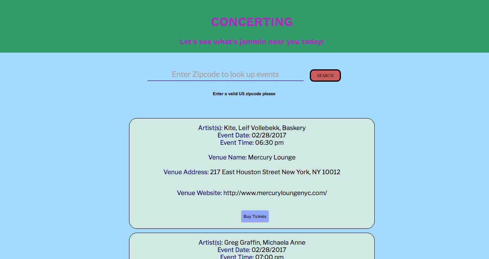

# <center> CONCERTING </center>
<br>




## Implementation
 I used React, and made sure to use multiple components. I created four components App, Input, Events, and EventFeed. I was able to style in CSS using Flexbox as well as utilizing Google fonts that would lead to a crisper UI such as Lato. I used a robust concert and event information API called Jambase. This API pulls in a great cross section of robust concert data when using zipcode , and really helped to fetch relevant data for each concert including URLs to external websites to buy tickets to most concerts.


## Technologies Used

For this project I used :
- Javascript
- React
- Axios
- Moment
- HTML
- CSS (Flexbox)


## Code Example from App and Events Component

##### Jambase API call in App.js

````javascript


class App extends Component {

constructor() {
  super();
  this.state= {
    zipcode:null
  }
  this.getEvents = this.getEvents.bind(this);
  this.addEvent = this.addEvent.bind(this);
}

  getEvents(zip) {
    axios({
      method: 'GET',
      url: `http://api.jambase.com/events?zipCode=${zip}&page=0&api_key=qzkxpjpx99tzazg3jubf7ts4`,
    }).then((res) => {
      console.log(res.data);
      this.setState({
        events:res.data.Events
      })
    })
  }


  addEvent() {
    if(this.state.events){
      if (this.state.events.length==0) {
      return (<h2><center>Please Enter a valid 5 digit US zip code, Thanks!</center></h2>)
      }

      let feed=(this.state.events)
      .map((event) => {
        return (
          <Events
            eachEvent={event}

             />
              )
      })
      return feed;
    }


````

##### Rendering relevant data for each concert in Events Component

````javascript

import React from 'react';
import axios from 'axios';
import moment from 'moment';

class Events extends React.Component {
  constructor(){
    super();

  }

  canBuy(){
    if(this.props.eachEvent.TicketUrl.length==0){
      return (<p>No website link to buy tickets</p>)

    }
    else{
      return <button className="buy">< a target="_blank" href={this.props.eachEvent.TicketUrl}>Buy Tickets</a></button>
    }
  }

  isthereUrl(){
    if(this.props.eachEvent.Venue.Url==0){
      return (<p>No venue website</p>)

    }
    else{
      return (
        <p><span className="list-field">Venue Website: </span><a target="_blank" href={this.props.eachEvent.Venue.Url}>{this.props.eachEvent.Venue.Url}</a></p>
      )
    }

  }

  regDisplay() {
    const artistsNames = this.props.eachEvent.Artists.map(artist => artist.Name);
    const artists = artistsNames.join(', ');
    return (
      <div>
    <li className="eachLi">
      <span className="list-field">Artist(s): </span>{artists}<br/>
      <span className="list-field">Event Date: </span> {moment(this.props.eachEvent.Date).format('MM/DD/YYYY')}<br/>
      <span className="list-field">Event Time: </span> {moment(this.props.eachEvent.Date).format('hh:mm a')}<br/>
      <br/>
      <span className="list-field">Venue Name: </span> {this.props.eachEvent.Venue.Name}<br/>
      <br/>
      <span className="list-field">Venue Address: </span> {`${this.props.eachEvent.Venue.Address}
      ${this.props.eachEvent.Venue.City}, ${this.props.eachEvent.Venue.StateCode} ${this.props.eachEvent.Venue.ZipCode}`}<br/>
      <br/>
      {this.isthereUrl()}<br/>
      {this.canBuy()}<br/>
      </li>
    </div>
    )
  }
  render() {
      return (
        this.regDisplay()
      );


}

}


export default Events;

````

## Build Strategy

- The initial implementation/idea was to use React Native to build a concerts list mobile web app that uses geolocation and zipcode to search for concert Events using the Jambase API and gives directions to each concert. However for now, it is a concert list web app the reasons for which, will be explained in the Complications/Future Improvements Section.

- I decided to use data from the API call using zipcode on the Jambase API, as it gave a robust list of concerts at smaller and mid sized venues within a 10 mile radius of a given zip code , and allows one to discover and explore new acts and artists. It has listings similar to publications such as  Village Voice and Timeout but with the ability to search for concerts across the U.S. There are already multiple apps and websites that allow users to search for concerts by artist and start and end dates. I wanted my app/website to be more for users interested in exploring new acts playing at smaller to mid sized venues near them.

- Components: The Events component is a child of EventFeed and EventFeed renders in or is a child of App component. Input component is a child of App. The data from the input fields in Input is passed on using refs to pass the zipcode entered into the getEvents function. This is then posted to Jambase via an external API call using axios. The Events array of objects found within the response data from the API call is passed to state as events. events from state are passed on to the Events component from the App component and the getEvents method is passed to the Input component where it is called on click of the Search button or on enter, with the zipcode value entered, as an argument.

- By mapping over the Events array from the response data from the axios API call made to Jambase , I was able to build an Event component for each concert listed. I had to map over an array Artists for each element in the events array, essentially a nested map.

- Additionally, I was able to add conditional rendering that would display a link for a venue or ticket url if given, and if not would render 'No venue website ' or  'No website to buy tickets ' respectively.

- After getting feedback from friends and classmates, from a user experience perspective they did not see the benefit of having a user login, and felt it would slow down the process of obtaining concert info and buying tickets.


## Contributors
GA and Hakuna Matata and Erick were my main contributors helping me through roadblocks, thank you so much for everything. Thanks for helping me figure out how to nest a map of an array within a map of another array Erick!

## Complications/Future Improvements

- There were initial successes creating this concert list web app using React Native. However, due to Xcode 7 and Operating System incompatibilities (not due to code), the xcode iphone simulator got stuck at build failures. Upgrading my OS and xcode in the middle of a project, was a risky proposition. I do hope to convert this into a react native app, with geolocation capabilities as soon as possible.

- As mentioned, I would like to add location within the React Native mobile app for each concert listed from the Jambase API call, onto Apple or Google maps and help give directions to each concert venue.

- Be able to filter or search for concert by keywords such as artist name, venue name and genre of music.

- I would like to add more dynamic and slick styling  and will look to make those improvements in the future.


## Authors

- Karthik Meda
- General Assembly
- Hakuna Matata Cohort
